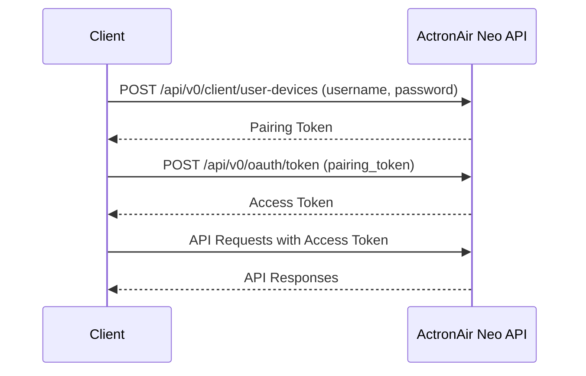

# Authentication

This document explains the authentication process for the ActronAir Neo API.

## Authentication Flow

The ActronAir Neo API uses a two-step OAuth 2.0 authentication flow:

1. Request a pairing token (refresh token) using username and password
2. Exchange the pairing token for an access token (bearer token)



## Step 1: Request Pairing Token

The first step is to request a pairing token by providing your ActronAir Neo account credentials.

### Request

**Endpoint:** `POST /api/v0/client/user-devices`

**Headers:**
```
Host: nimbus.actronair.com.au
Content-Type: application/x-www-form-urlencoded
```

**Body Parameters:**
| Parameter | Description |
|-----------|-------------|
| username | Your ActronAir Neo account username (email) |
| password | Your ActronAir Neo account password |
| client | Client type (ios, android, windowsphone, or loadtest) |
| deviceName | A unique name for the device being authorized |
| deviceUniqueIdentifier | A unique identifier for the device |

**Example Request:**
```http
POST /api/v0/client/user-devices HTTP/1.1
Host: nimbus.actronair.com.au
Content-Type: application/x-www-form-urlencoded

username=your_email@example.com&password=your_password&client=ios&deviceName=HomeAssistant&deviceUniqueIdentifier=ha-actronair-neo-12345
```

### Response

**Success Response (200 OK):**
```json
{
    "id": "device_id_value",
    "deviceName": "HomeAssistant",
    "pairingToken": "pairing_token_value",
    "expires": "2023-12-31T23:59:59Z",
    "_links": {
        "self": {
            "href": "/api/v0/client/user-devices/device_id_value"
        }
    }
}
```

**Error Response (401 Unauthorized):**
```json
{
    "error": "invalid_grant",
    "error_description": "The user credentials are incorrect."
}
```

## Step 2: Exchange Pairing Token for Access Token

The second step is to exchange the pairing token for an access token.

### Request

**Endpoint:** `POST /api/v0/oauth/token`

**Headers:**
```
Host: nimbus.actronair.com.au
Content-Type: application/x-www-form-urlencoded
```

**Body Parameters:**
| Parameter | Description |
|-----------|-------------|
| grant_type | Must be "refresh_token" |
| refresh_token | The pairing token received in step 1 |
| client_id | Must be "app" |

**Example Request:**
```http
POST /api/v0/oauth/token HTTP/1.1
Host: nimbus.actronair.com.au
Content-Type: application/x-www-form-urlencoded

grant_type=refresh_token&refresh_token=pairing_token_value&client_id=app
```

### Response

**Success Response (200 OK):**
```json
{
    "access_token": "access_token_value",
    "token_type": "bearer",
    "expires_in": 259199
}
```

**Error Response (400 Bad Request):**
```json
{
    "error": "invalid_grant",
    "error_description": "The refresh token is invalid."
}
```

## Using the Access Token

After obtaining the access token, include it in the `Authorization` header of all API requests.

**Example:**
```http
GET /api/v0/client/ac-systems HTTP/1.1
Host: nimbus.actronair.com.au
Authorization: Bearer access_token_value
```

## Token Expiration and Renewal

The access token expires after the time specified in the `expires_in` field (in seconds). When the token expires, you need to request a new one using the pairing token.

If the pairing token also expires, you need to start the authentication process from the beginning.

## Implementation in the Integration

The ActronAir Neo integration handles authentication automatically:

1. During setup, the user provides their ActronAir Neo account credentials
2. The integration requests a pairing token and stores it securely
3. The integration exchanges the pairing token for an access token
4. The integration uses the access token for all API requests
5. When the access token expires, the integration automatically renews it
6. If the pairing token expires, the integration prompts the user to re-authenticate

## Error Handling

The integration handles various authentication errors:

| Error | Description | Resolution |
|-------|-------------|------------|
| Invalid credentials | Username or password is incorrect | User needs to provide correct credentials |
| Invalid refresh token | Pairing token has expired or is invalid | Integration requests a new pairing token |
| Rate limiting | Too many authentication attempts | Integration implements exponential backoff |
| Network errors | Connection issues | Integration retries with backoff |

## Security Considerations

The integration follows these security best practices:

1. Credentials are stored securely in Home Assistant's secure storage
2. Tokens are never logged or exposed in the UI
3. HTTPS is used for all API communication
4. Minimal permissions are requested

## Code Example

Here's how the integration handles authentication:

```python
async def authenticate(self) -> bool:
    """Authenticate with the ActronAir Neo API."""
    try:
        # Step 1: Request pairing token
        pairing_response = await self._request_pairing_token()
        pairing_token = pairing_response["pairingToken"]
        
        # Step 2: Exchange for access token
        token_response = await self._request_access_token(pairing_token)
        self._access_token = token_response["access_token"]
        self._token_type = token_response["token_type"]
        self._token_expiry = time.time() + token_response["expires_in"]
        
        return True
    except ActronNeoAuthenticationError:
        # Handle authentication errors
        return False
```

## Next Steps

- [Commands](commands.md): Learn how to send commands to the ActronAir Neo API
- [Queries](queries.md): Learn how to query data from the ActronAir Neo API
